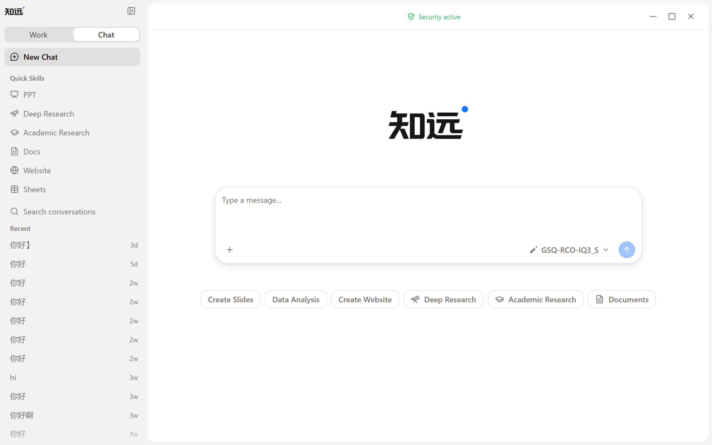

# Creating Your First Work Page

After completing the [Quick Start](./quick-start.md) and configuring a model, you can create your first Work Page.

## Understanding the Work Page

The Work Page is where ZhiYuan starts working. The center of the page is the task input area, where you can select a model, set the permission scope (Ask for permission or Allow all), and choose the project the task belongs to.

## Starting Your First Task

1. Describe what you want to accomplish in the task input area.
2. If the task requires reading or processing files, provide the relevant materials and context first.
3. Confirm the currently selected model and the permission scope the task needs.
4. Start with a small, clearly scoped task and observe how ZhiYuan executes it.

For example, you can start with a clear small goal: organizing a file, summarizing a set of materials, or generating a first draft from existing content.

## Using Quick Skills

Below the task input area, the Work Page offers quick skill entries such as Create Slides, Data Analysis, Create Website, Deep Research, Academic Research, and Documents.

1. Click a quick skill, for example "Create Slides".
2. Describe the content you want to present in the task input area, such as a quarterly work summary, a project report, or a course lecture.
3. Submit the task and wait for ZhiYuan to generate the result.
4. Review the result and continue requesting revisions until it meets your expectations.

## Working in Projects

If a task belongs to a project, you can enter Projects from the Work Page to keep related tasks and materials in one place. Project names and specific content depend on the version you are using.

After completing your first task, you can continue with [Creating and Running Tasks](./tasks.md) and [Adding Files and Context](./context.md).
