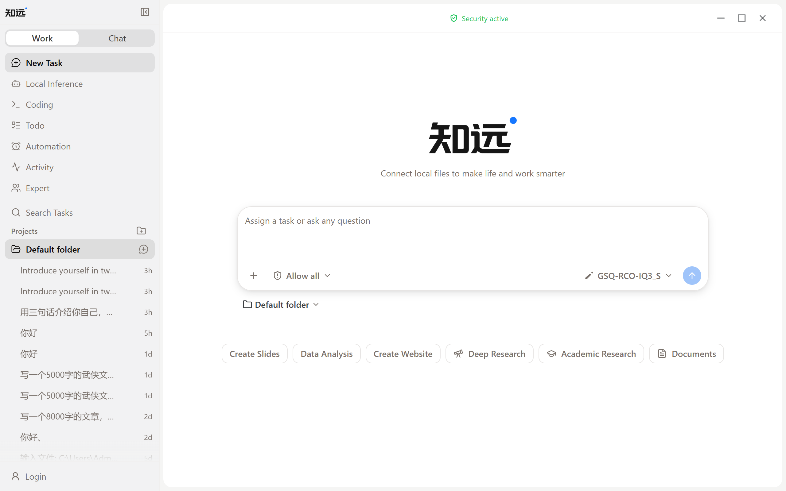

# Creating Your First Work Page

After completing the [Quick Start](./quick-start.md) and configuring a model, you can create your first Work Page.

## Understanding the Work Page

The Work Page is where ZhiYuan starts working. The center of the page is the task input area. At the bottom you can select a model and request permissions, and below that you can enter Projects.

## Starting Your First Task

1. Describe what you want to accomplish in the task input area.
2. If the task requires reading or processing files, provide the relevant materials and context first.
3. Confirm the currently selected model and the permission scope the task needs.
4. Start with a small, clearly scoped task and observe how ZhiYuan executes it.

For example, you can start with a clear small goal: organizing a file, summarizing a set of materials, or generating a first draft from existing content.

## Generating a PPT

You can select a PPT template directly on the Work Page and have ZhiYuan generate a presentation from your content.

1. Select a suitable PPT template at the bottom of the page.
2. Add the content you want to present in the task input area, and adjust the theme, structure, or other parameters as needed.
3. Submit the task and wait for ZhiYuan to generate the PPT.
4. Review the result and continue requesting revisions until it meets your expectations.

For example, you can enter content such as a quarterly work summary, a project report, a course lecture, or an industry analysis, then select the corresponding template to start.

## Working in Projects

If a task belongs to a project, you can enter Projects from the Work Page to keep related tasks and materials in one place. Project names and specific content depend on the version you are using.

After completing your first task, you can continue with [Creating and Running Tasks](./tasks.md) and [Adding Files and Context](./context.md).
