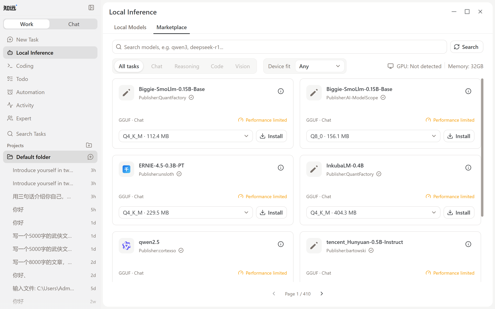
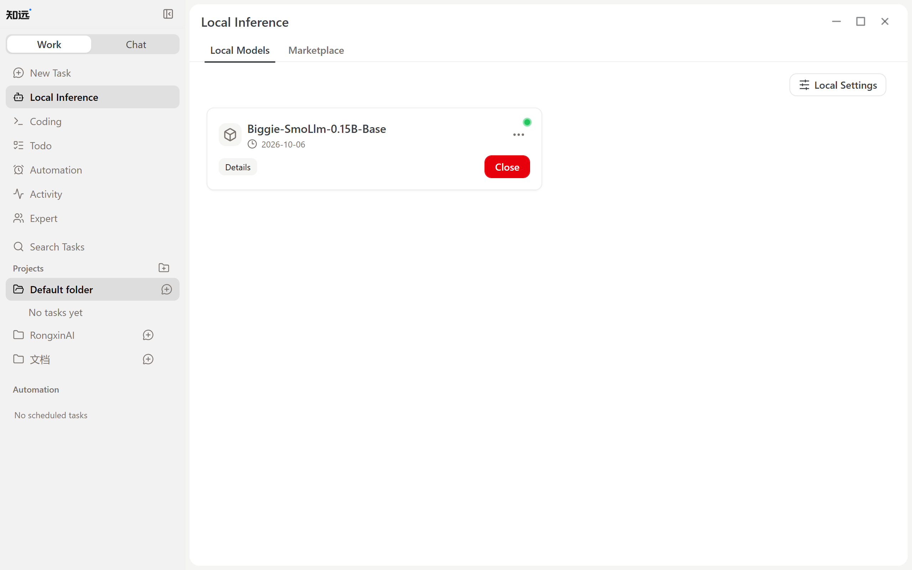
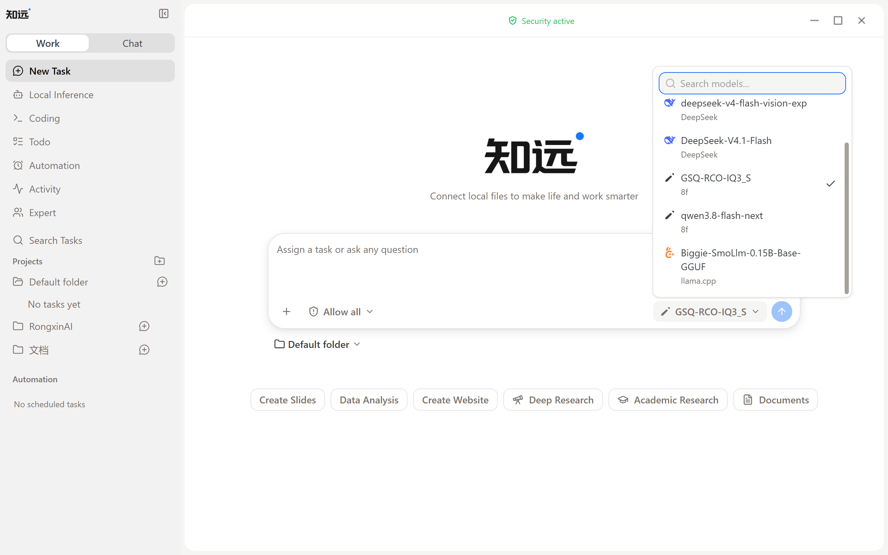

# Local Inference

Local Inference means running the model directly on your computer instead of sending inference requests to a cloud model service. The ZhiYuan agent supports installing and running local models in GGUF format, and using local models for Chat and agent tasks.

## When to Use It

Local Inference reduces the need to send sensitive content to cloud model services, giving you more control over the data the model processes and the environment it runs in. Local models are especially suitable for the following scenarios:

- Analyzing unpublished product plans, research materials, and financial data;
- Processing contracts, customer information, or internal company knowledge;
- Conducting code reviews, security analysis, and log troubleshooting;
- Working in environments with unstable networks or without continuous access to cloud services.

Local Inference only means model inference happens on your machine. If a task also uses web search, MCP, email, or other external services, the related data may still leave your computer. Before processing sensitive materials, also check the tools and permission settings the task uses.

## Getting Started

### 1. Select and Install a Model

Go to Model Marketplace under Local Inference, select a GGUF model suitable for your device, and install it. Models in the Model Marketplace and their related files are provided by third-party model distribution channels such as [ModelScope](https://modelscope.cn/).

The ZhiYuan agent shows compatibility suggestions based on detected device resources such as memory and GPU, but these suggestions are for reference only. Before installing, you can also check the model publisher, file size, and quantization version. If this is your first time, it is recommended to choose a recommended version or a model with a smaller parameter size.

### 2. Start a Local Model

After installation, switch to the Local models page. Models downloaded from the Model Marketplace are listed here. Start the model you want to use, and it becomes available for tasks.

### 3. Select the Model in a Task

Create a New Task, select the started local model in the model selector of the input area, then enter your request and start execution.

## Speed and Runtime Parameters

The response speed of a local model is affected by factors such as parameter size, quantization version, context length, GPU offloading, CPU thread count, batch size, and the current device load. Longer context usually consumes more memory and may increase processing time. When VRAM is sufficient, increasing GPU offloading appropriately can improve inference speed.

When starting out, it is recommended to keep the recommended parameters, confirm the model responds reliably with simple tasks, and then adjust parameters one by one based on speed, memory usage, and task results. If the model is too large or the parameter settings exceed the device's capacity, loading may be slow, operation may be unstable, or the model may fail to start.

For detailed steps on installing and starting models, read [Using Local Models](./model/local.md).
