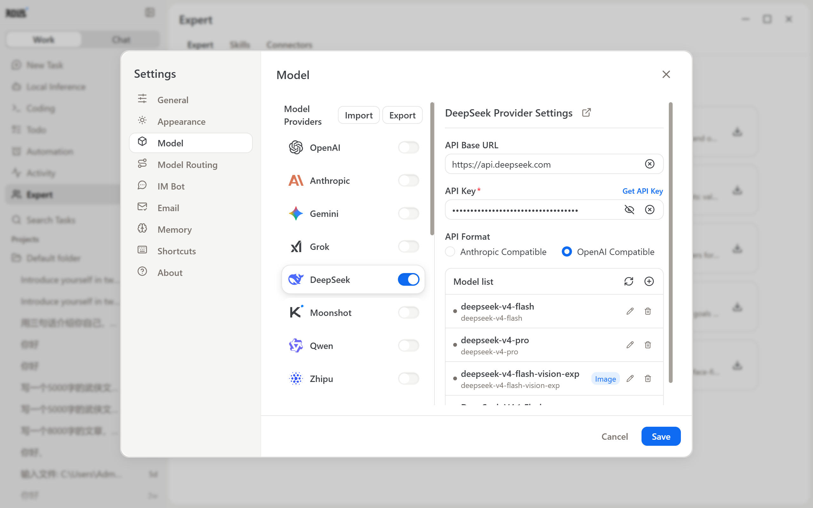

# Using Cloud Models (DeepSeek as an Example)

ZhiYuan can connect to cloud models to process tasks. Besides the built-in free ZhiYuan model, the app supports providers including DeepSeek, OpenAI, Anthropic, Gemini, Moonshot, and Qwen, and you can also add a custom endpoint.

Taking DeepSeek as an example:

1. Create an API Key on the [DeepSeek Open Platform](https://platform.deepseek.com/api_keys). Copy and store it properly immediately after creation; the API Key is usually only shown in full at creation time.
2. Open "Settings → Model" in ZhiYuan and select DeepSeek in the model provider list.
3. Paste the API Key and save. The settings page also provides a "Get API Key" link that takes you to the provider's key page.

After configuration, confirm the model responds normally with a simple task before moving on to complex tasks.

The supported providers, fields, and parameters are subject to the app settings of the current version.
