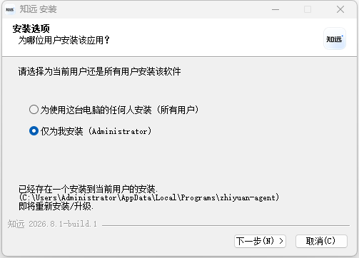
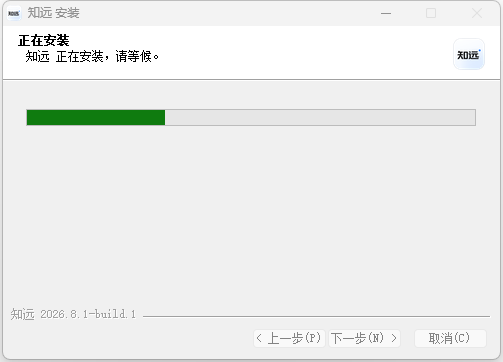

# Quick Start

The ZhiYuan agent is a desktop application. On first use, prepare it in this order: download, install, configure a model, create a Work Page.

## Download

Select the installer matching your system from the [download section on the official website homepage](https://www.rongxzyai.com/#download). The download section reads the latest stable release and provides:

- Windows x64 installer.
- macOS Apple Silicon installer.
- Ubuntu x64 `.deb` package.
- x64 AppImage for other Linux distributions.

The version number, file size, and download URLs shown in the download section update automatically with the current stable release.

## Installation

After downloading, complete the installation according to your operating system. The installation steps shown by the system vary by installer type.

If the system asks you to confirm the source or permissions, first confirm the installer comes from the ZhiYuan agent [official website](https://www.rongxzyai.com/), then continue.

## First Launch
The installation page is shown below. Without special requirements, click Next to complete the installation.

Installation takes about two to three minutes.

On first launch, you will see the ZhiYuan Work Page. It includes the task input area, model selection, permission settings, and the Projects entry. You can start assigning tasks from here.

After installation, launch the ZhiYuan agent. It is recommended to complete the setup in the following order:

1. Open the ZhiYuan agent.
2. Complete model configuration and choose a cloud model or a local model. [DeepSeek](https://platform.deepseek.com/) can be a cost-effective choice.
3. Create a [Work Page](./first-work-page.md).
4. Confirm the model responds normally with a simple task.

After completing these steps, you can continue with [Creating and Running Tasks](./tasks.md).

## Preparation Before Starting

- If using a cloud model, prepare the connection information required by the provider.
- If using a local model, reserve enough disk, memory, and compute resources.
- If processing files, place the relevant materials in the Work Page and confirm the scope of use.

## Troubleshooting

If you cannot install or launch the app, see [Installation and Updates](../faq/install.md) first. If the app opens but the model does not work, see [Model Connection](../faq/model.md).
