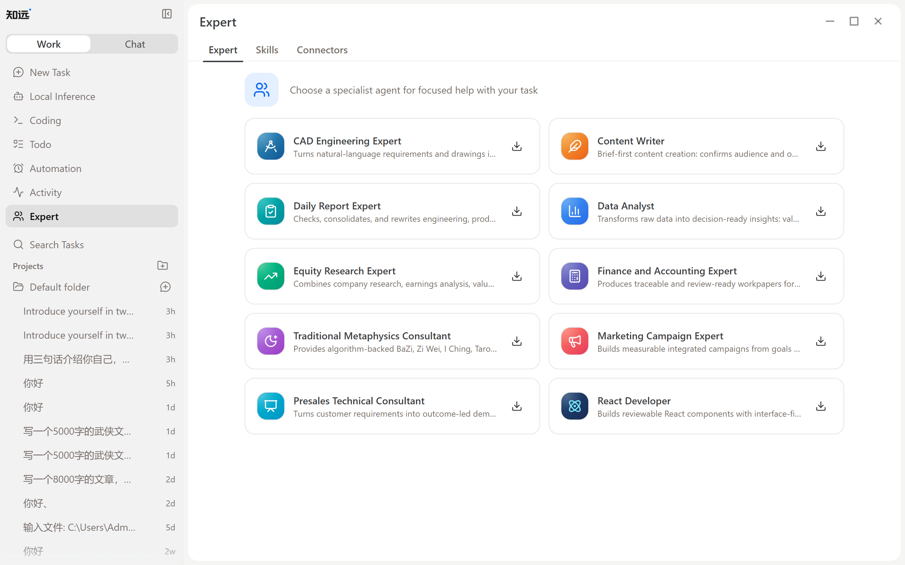

# Using and Managing Skills

Skills are reusable capabilities for specific types of work. ZhiYuan ships with dozens of built-in Skills covering document processing, spreadsheets, research, writing, marketing, and coding.

Skills, Experts, and Connectors are managed together on the Expert page in the sidebar, which has three tabs:

- **Expert**: preset agents for professional scenarios. Once installed, you can talk to them directly.
- **Skills**: view installed Skills, or install more from the Skill Marketplace.
- **Connectors**: manage MCP servers that connect external tools and services.

Before using a Skill, confirm it fits the current task, then provide the necessary materials and goals. Different Skills may require different inputs and outputs; refer to each Skill's own documentation for details.
