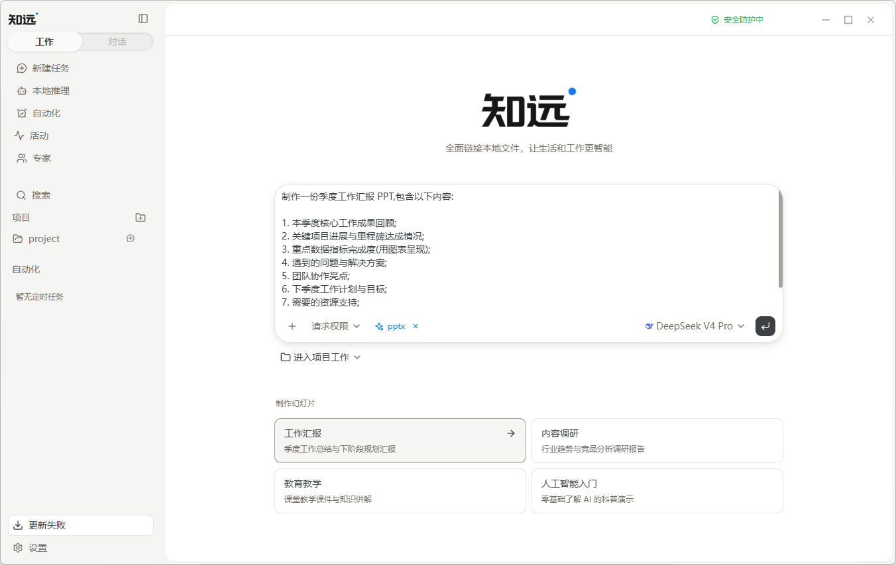

# 创建第一个工作页面

完成[快速开始](./quick-start.md)并配置好模型后，就可以创建第一个工作页面。

## 认识工作页面

工作页面是知远开始工作的地方。页面中间是任务输入区，底部可以选择模型和请求权限，下面还可以进入项目工作。

## 开始第一个任务

1. 在任务输入区说明你希望完成的事情。
2. 如果任务需要读取或处理文件，先提供相关资料和上下文。
3. 确认当前选择的模型，以及任务需要的权限范围。
4. 先从一个范围清楚的小任务开始，观察知远的执行结果。

例如，你可以先提出一个明确的小目标：整理一份文件、概括一组资料，或根据已有内容生成一份初稿。

## 生成一个 PPT

你可以直接在工作页面中选择 PPT 模板，让知远根据你的内容生成一份演示文稿。

1. 在页面下方选择一个合适的 PPT 模板。
2. 在任务输入区加入你想表达的内容，并根据需要修改主题、结构或其他参数。
3. 提交任务，等待知远生成 PPT。
4. 查看生成结果，并继续提出修改要求，逐步调整到满意的效果。

例如，你可以输入季度工作总结、项目汇报、课程讲解或行业分析等内容，再选择对应模板开始制作。

## 在项目中工作

如果任务属于某个项目，可以从工作页面进入项目工作，让相关任务和资料保持在同一处。项目名称和具体内容以你当前使用的版本为准。

完成第一次任务后，可以继续阅读[创建和执行任务](./tasks.md)和[添加文件与上下文](./context.md)。
