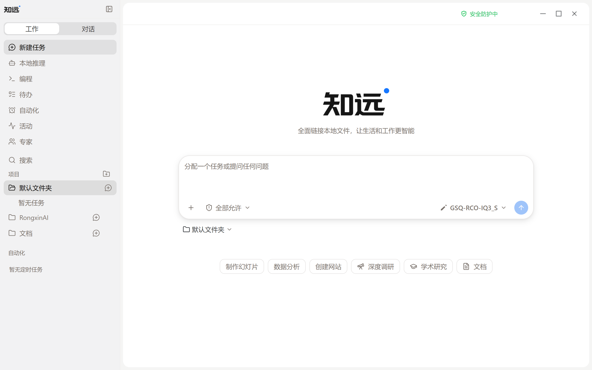
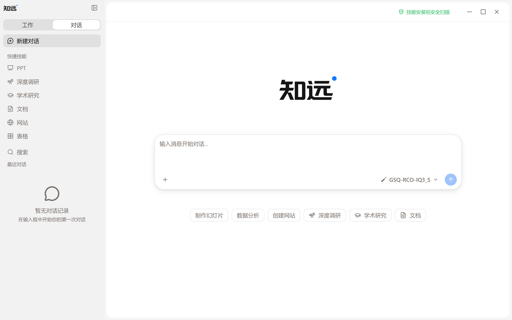

# 创建第一个工作页面

完成[快速开始](./quick-start.md)并配置好模型后，就可以创建第一个工作页面。

## 认识工作页面

工作页面是知远开始工作的地方。页面中间是任务输入区，输入区内可以选择模型、设置权限范围（请求确认或全部允许），并选择任务所属的项目。

## 开始第一个任务

1. 在任务输入区说明你希望完成的事情。
2. 如果任务需要读取或处理文件，先提供相关资料和上下文。
3. 确认当前选择的模型，以及任务需要的权限范围。
4. 先从一个范围清楚的小任务开始，观察知远的执行结果。

例如，你可以先提出一个明确的小目标：整理一份文件、概括一组资料，或根据已有内容生成一份初稿。

## 使用快捷技能

工作页面下方提供制作幻灯片、数据分析、创建网站、深度调研、学术研究、文档等快捷技能入口。

1. 点击一个快捷技能，例如「制作幻灯片」。
2. 在任务输入区说明你想表达的内容，例如季度工作总结、项目汇报或课程讲解。
3. 提交任务，等待知远生成结果。
4. 查看结果并继续提出修改要求，逐步调整到满意的效果。

## 在项目中工作

如果任务属于某个项目，可以从工作页面进入项目工作，让相关任务和资料保持在同一处。项目名称和具体内容以你当前使用的版本为准。

完成第一次任务后，可以继续阅读[创建和执行任务](./tasks.md)和[添加文件与上下文](./context.md)。
