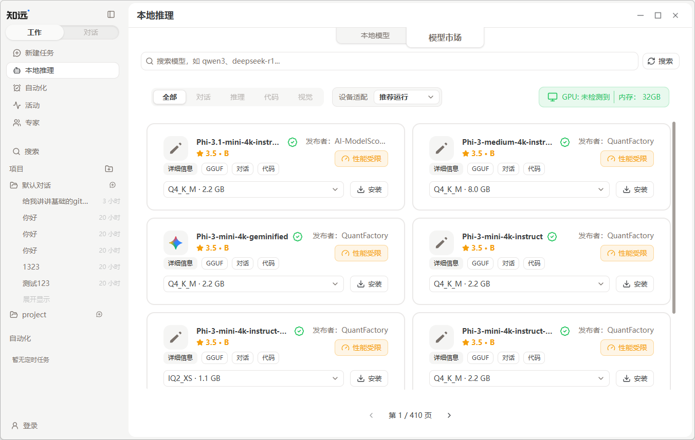
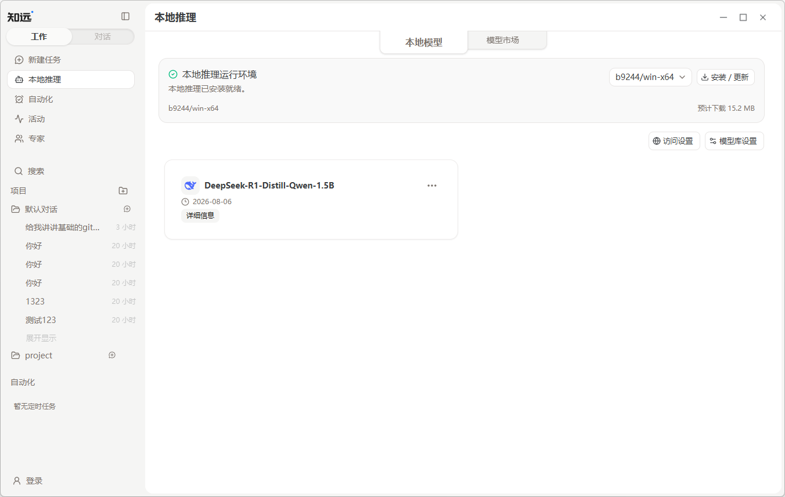
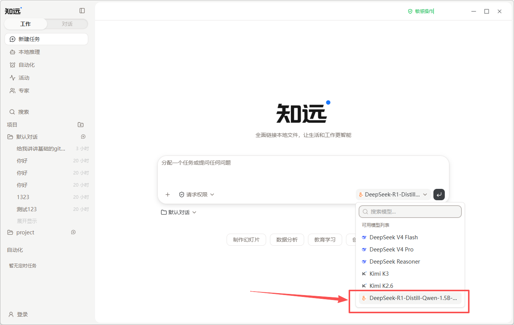

# 本地推理

本地推理是指让模型直接在你的电脑上运行，而不是把推理请求发送到云端模型服务。知远智能体支持安装和运行 GGUF 格式的本地模型，并将本地模型用于对话和智能体任务。

## 什么时候适合使用

本地推理可以减少敏感内容发送到云端模型服务的需要，让你更容易掌控模型处理的数据和运行环境。以下场景尤其适合使用本地模型：

- 分析尚未公开的产品规划、研究材料和财务数据；
- 处理合同、客户资料或企业内部知识；
- 开展代码审查、安全分析和日志排查；
- 在网络不稳定或无法持续连接云端服务的环境中工作。

本地推理只表示模型推理在本机完成。如果任务还使用联网搜索、MCP、邮件或其他外部服务，相关数据仍可能离开电脑。处理敏感资料前，请同时检查任务使用的工具和权限设置。

## 开始使用

### 1. 选择并安装模型

前往「本地推理」中的「模型市场」，选择适合设备的 GGUF 模型并安装。模型市场中的模型及相关文件由 [ModelScope 魔搭社区](https://modelscope.cn/) 等第三方模型发布渠道提供。

知远智能体会结合检测到的内存、GPU 等设备资源显示适配建议，但该建议仅供参考。安装前还可以查看模型发布者、文件大小和量化版本；如果是第一次使用，建议优先选择推荐版本或参数规模较小的模型。

### 2. 启动本地模型

安装完成后，切换到「本地模型」页面。通过模型市场下载的模型会集中显示在这里，启动需要使用的模型后，即可将它用于任务。

### 3. 在任务中选择模型

创建新任务，在输入区域的模型选择器中选中已启动的本地模型，然后输入你的需求并开始执行。

## 速度与运行参数

本地模型的响应速度会受到模型参数规模、量化版本、上下文长度、GPU 卸载、CPU 线程数、批处理大小和设备当前负载等因素影响。更长的上下文通常会占用更多内存，也可能延长处理时间；在显存充足时，合理增加 GPU 卸载可以提升推理速度。

刚开始使用时，建议先保留推荐参数，用简单任务确认模型能够稳定响应，再根据速度、内存占用和任务效果逐项调整。模型过大或参数设置超过设备承载能力时，可能出现加载缓慢、运行不稳定或无法启动的情况。

有关模型安装和启动的具体步骤，请阅读[使用本地模型](./model/local.md)。
