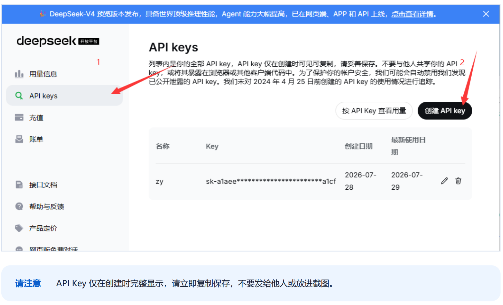

# 配置云端模型

云端模型由模型服务商运行。知远智能体通过 API Key、OAuth 或兼容接口连接这些服务。具体可用的鉴权方式，以设置页中该提供商显示的选项为准。

## 配置前准备

通常需要准备：

- 模型服务商账号。
- 可用的 API Key 或订阅授权。
- 模型名称或模型 ID。
- 自定义接口需要使用的 API Base URL 和协议格式。

API 调用可能产生费用。余额、限额和数据处理规则由模型服务商决定。

## 添加模型提供商

1. 打开知远智能体左下角的「设置」。
2. 进入「模型提供商」，选择需要使用的服务商。
3. 按页面要求填写 API Key，或完成浏览器授权。
4. 保留服务商提供的默认 API Base URL。使用代理、私有网关或兼容接口时，再按服务说明修改。
5. 开启该提供商。

以 DeepSeek 为例，可以在 [DeepSeek 开放平台](https://platform.deepseek.com/api_keys)创建 API Key。密钥通常只在创建时完整显示，应立即保存，不要放入截图、公开文档或代码仓库。

## 添加和检查模型

提供商配置完成后，检查「可用模型列表」。如果所需模型不在列表中，可以选择「添加模型」，填写页面要求的信息：

- **模型名称**用于界面显示。
- **模型 ID**必须与服务商接口要求一致。
- **上下文窗口**应填写模型官方公布的上限。
- **模型能力**只开启已经确认支持的项目，例如工具调用或图片输入。

自定义提供商还需要选择正确的 API 协议格式。接口文档写明兼容 OpenAI 时，选择 OpenAI 兼容格式；不确定时不要修改工作模式兼容参数。

完成后选择「测试连接」。连接成功表示当前地址和鉴权信息可以完成测试请求，不代表该模型支持所有工具或文件类型。

## 在任务中使用

返回工作页面，在输入区右下角打开模型选择器，选择刚配置的模型。先发送一个简短任务，确认响应正常，再处理长文档或多步骤工作。

出现鉴权失败、余额不足、模型不存在或接口格式错误时，参照[模型连接问题](../../faq/model.md)逐项检查。
