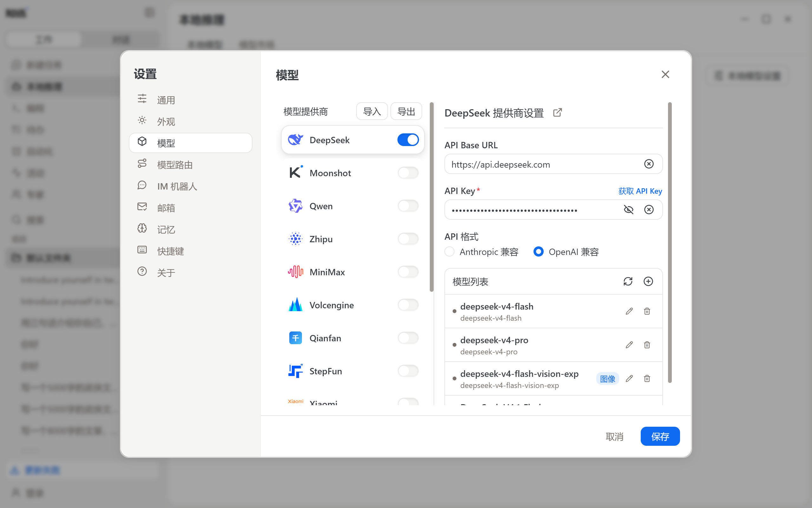

# 使用云端模型（以 DeepSeek 为例）

知远可以连接云端模型来处理任务。除内置的知远免费模型外，应用支持 DeepSeek、OpenAI、Anthropic、Gemini、Moonshot、Qwen 等多家服务商，也可以添加自定义接口。

以 DeepSeek 为例：

1. 在[DeepSeek 开放平台](https://platform.deepseek.com/api_keys)创建 API Key。创建后请立即复制并妥善保存，API Key 通常只会在创建时完整显示。
2. 打开知远的「设置 → 模型」，在模型提供商列表中选择 DeepSeek。
3. 粘贴 API Key 并保存。设置页也提供「获取 API Key」入口，可以直接跳转到服务商的申请页面。

配置完成后，先用一个简单任务确认模型可以正常响应，再开始处理复杂任务。

具体支持的服务商、字段和参数以当前版本的应用设置为准。
