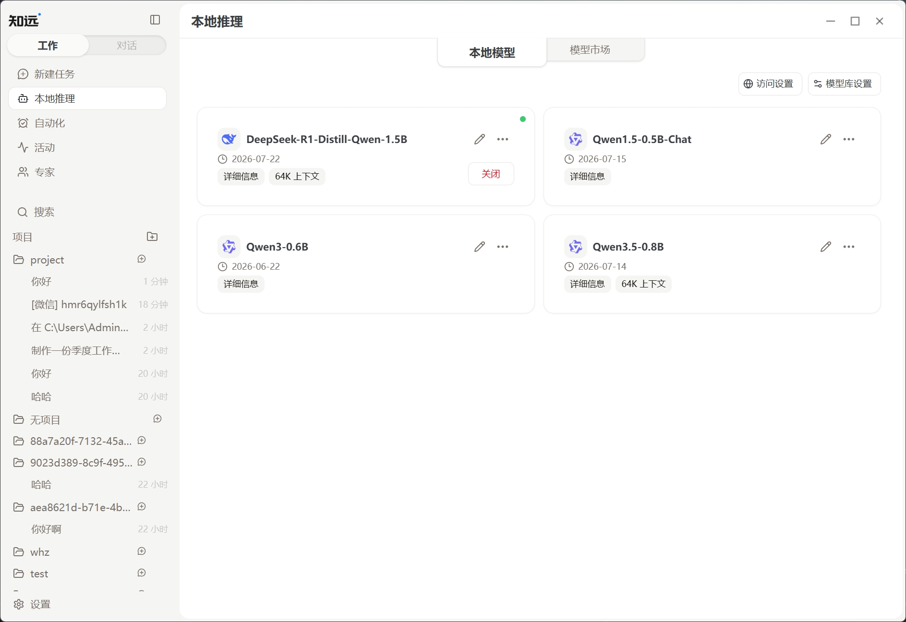

# 使用本地模型

本地模型直接在当前电脑上运行。知远智能体可以管理 GGUF 模型，并把已经加载的模型用于对话或工作任务。

本地运行不等于整个任务都不联网。任务如果调用搜索、邮件、MCP 或其他外部服务，相关内容仍可能发送给对应服务。

## 安装模型

1. 打开侧边栏中的「本地推理」。
2. 进入「模型市场」。
3. 根据模型大小、量化版本和设备适配提示选择模型。
4. 查看下载文件和来源后开始安装。

模型文件通常较大。安装前检查磁盘空间；内存或显存有限时，先选择参数规模较小的量化模型。模型市场的适配建议用于缩小选择范围，实际速度和稳定性仍取决于设备与启动参数。

## 启动模型

安装完成后，进入「本地模型」页面：

1. 找到需要使用的模型。
2. 保留默认加载参数，启动模型。
3. 等待状态变为可用，再返回工作页面。

只有当前已经加载且服务可用的模型，才会出现在工作页面的模型选择器中。关闭本地推理服务或卸载模型后，对应选项会停止工作。

## 开始第一个任务

在工作页面选择已启动的本地模型，先执行一个短任务。确认响应速度、内存占用和输出稳定后，再逐步增加文件数量和上下文长度。

工作模式对上下文和工具调用能力有额外要求。如果界面提示上下文不足或模型不支持工具调用，请按提示重新加载模型，或改用具备相应能力的模型。不要仅凭模型名称手动开启未经确认的能力。

## 调整运行效果

模型过慢、加载失败或占用过高时，优先按以下顺序处理：

1. 关闭其他占用内存或显存的程序。
2. 减小上下文长度或改用更小的量化文件。
3. 恢复默认启动参数后重新加载。
4. 根据设备情况调整 GPU 卸载和线程数。

完整的模型市场、参数与隐私说明见[本地推理](../local-inference.md)。
