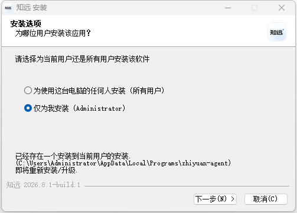
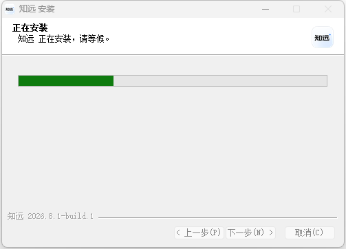
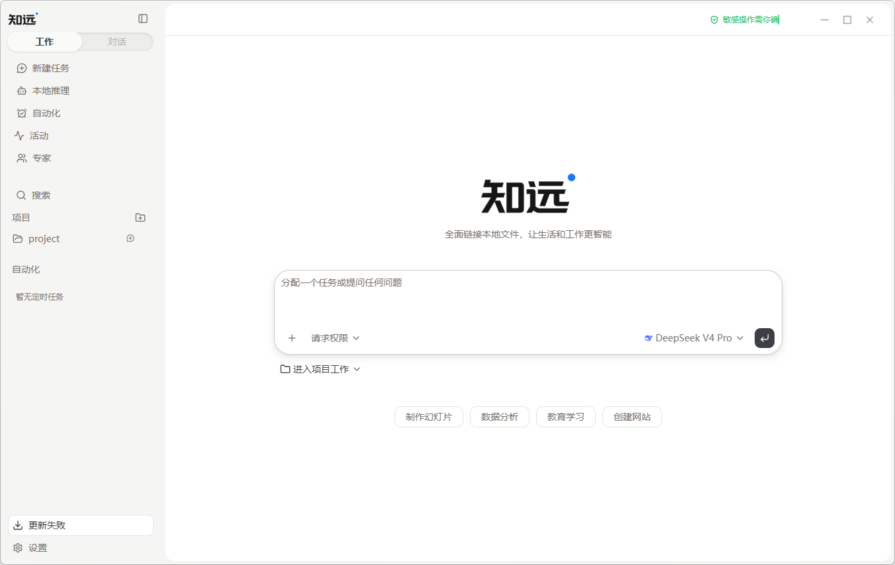

# 快速开始

知远智能体是一款桌面应用。第一次使用时，按“下载、安装、配置模型、创建工作页面”的顺序准备即可。

## 下载

请从[官网首页的下载区域](https://www.rongxzyai.com/#download)选择与你的系统相匹配的安装包。当前下载区会读取最新的稳定版本，并提供：

- Windows x64 安装包。
- macOS Apple Silicon 安装包。
- Ubuntu x64 `.deb` 安装包。
- 面向其他 Linux 发行版的 x64 AppImage。

下载区显示的版本号、文件大小和下载地址会随当前稳定版本自动更新。

## 安装

下载完成后，按照你的操作系统完成安装。安装包类型不同，系统显示的安装步骤也会不同。

如果系统提示需要确认来源或权限，请先确认安装包来自知远智能体[官网](https://www.rongxzyai.com/)，再继续安装。

## 第一次启动
安装页面如图所示，没有特殊需求点击下一步完成安装即可。

安装大约需要两到三分钟。

首次启动后，你会看到知远的工作页面。它包含任务输入区、模型选择、权限设置和项目入口，可以从这里开始分配任务。

安装完成后启动知远智能体。建议按下面的顺序完成准备：

1. 打开知远智能体。
2. 完成模型配置，选择云端模型或本地模型。可以使用 [DeepSeek](https://platform.deepseek.com/) 做为比较有性价比的选择。
3. 创建一个[工作页面](./first-work-page.md)。
4. 用一个简单任务确认模型可以正常响应。

完成这些步骤后，就可以继续尝试[创建和执行任务](./tasks.md)。

## 开始前的准备

- 如果使用云端模型，请准备服务商要求的连接信息。
- 如果使用本地模型，请预留足够的磁盘、内存和计算资源。
- 如果要处理文件，请把相关资料放入工作页面，并确认使用范围。

## 遇到问题

如果无法安装或启动，请先查看[安装与更新](../faq/install.md)。如果应用可以打开但模型无法工作，请查看[模型连接](../faq/model.md)。
