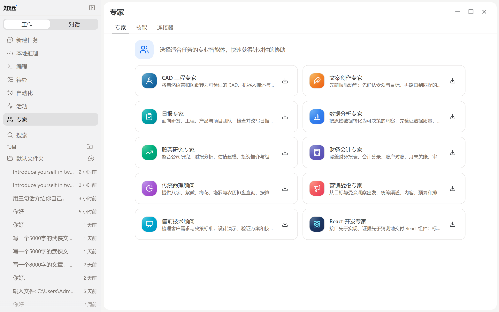

# 使用与管理技能

技能是面向特定工作类型的可复用能力。知远内置数十个技能，覆盖文档处理、表格、研究、写作、营销、编程等方向。

技能与专家、连接器统一在侧边栏的「专家」页面管理，页内分为三个标签：

- **专家**：面向职业场景的预设智能体，安装后可以直接对话。
- **技能**：查看已安装的技能，或从技能市场安装更多技能。
- **连接器**：管理 MCP 服务器，连接外部工具和服务。

使用技能时，先确认它适合当前任务，再提供必要的资料和目标。不同技能需要的输入和输出可能不同，具体说明以技能自身文档为准。
